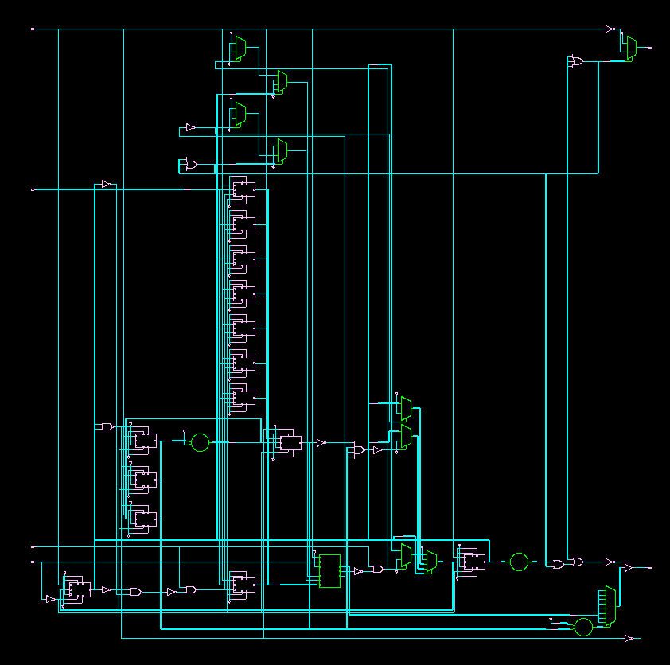

# SPI-to-I2C-FIFO-Converter
# 🔄 Efficient Data Buffering and Flow Control Using FIFO in SPI to I2C Protocol Conversion

This project implements a **Verilog-based protocol converter** between **SPI** (Serial Peripheral Interface) and **I2C** (Inter-Integrated Circuit) using a **FIFO buffer**. The design ensures smooth and efficient data flow across two different communication protocols, handling clock domain mismatches and burst data transfers.

---

## 🚀 Project Overview

- **Objective**: To create a robust hardware solution for converting data from SPI input to I2C output with reliable buffering.
- **Design Components**:
  - SPI to I2C Protocol Conversion
  - FIFO-Based Data Buffer
  - State Machine Controller
- **Language**: Verilog HDL
- **Verification**: Testbench with ModelSim/GTKWave output

---

## 📁 File Structure

| File / Folder            | Description                                 |
|--------------------------|---------------------------------------------|
| `SPI-to-I2C-FIFO-Converter-Design.v`                 | Top-level Verilog module (SPI to I2C)       |
| `SPI-to-I2C-FIFO-Converter-Testbench.v`            | Testbench module                            |
| `README.md`              | Project documentation                       |
| `Schematic.png`          | Schematic of top-level design               |
| `Top Level Design Module.png` | Block-level diagram                    |
| `Cadence Waveform.png` | RTL simulation waveform from Cadence   |
| `EDA_Playground Waveform.jpg` | Online simulation waveform      |
| `Gate Report.png`        | Synthesis report - gate-level view          |
| `Power Report.png`       | Power analysis post-synthesis               |
| `Area Report.png`        | Area utilization summary                    |
| `Timing Report.png`      | Timing constraints & slack report           |

---

## 🧠 Key Features

- **Protocol Conversion**: SPI data received and converted to I2C-compatible output
- **FIFO Buffering**: Smooth transition and flow control between different clock domains
- **Finite State Machine (FSM)**: Handles state transitions between SPI write, FIFO read, and I2C send
- **Testbench Simulation**: Verified design across multiple test cases
- **Cadence Reports**: Detailed gate, timing, power, and area metrics

---

## 📸 Visuals & Artifacts

### ✅ Block Diagram

### ✅ Schematic

### ✅ Simulation Results
- **Cadence Simulation**:
  

- **EDA Playground Simulation**:
  

---

## 📊 Synthesis Reports

| Report         | Image |
|----------------|-------|
| 🧱 **Gate Report** |  |
| ⚡ **Power Report** |  |
| 📐 **Area Report**  |  |
| ⏱️ **Timing Report** |  |

---

## 🙋‍♂️ Author

**Chandra Shekhar R**  
📍 Aspiring Data Analyst | Python & SQL Enthusiast  
🔗 [GitHub – ChandraShekharR07](https://github.com/ChandraShekharR07)  
🔗 [LinkedIn – chandra-shekhar-r-434849287](https://www.linkedin.com/in/chandra-shekhar-r-434849287/)

